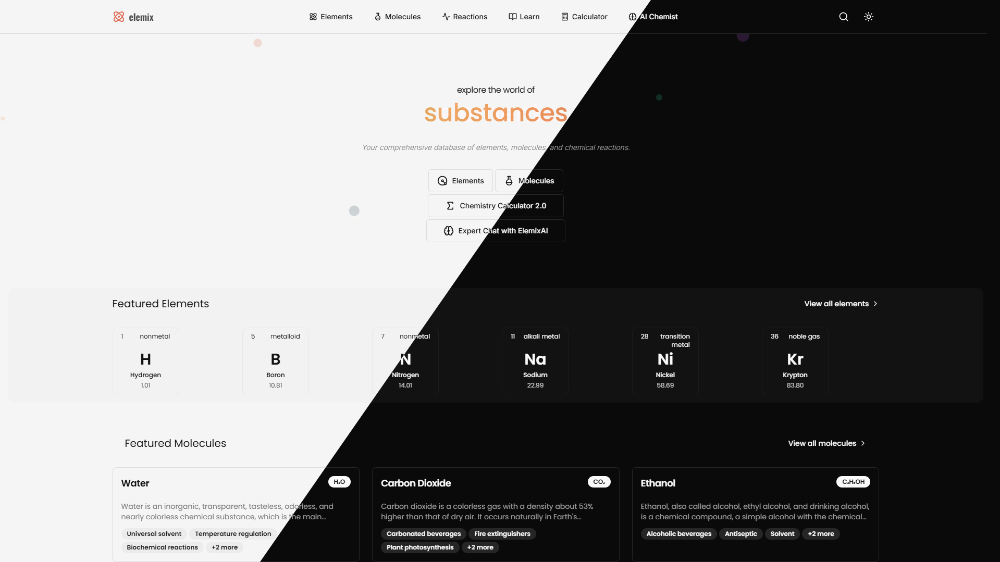

# Elemix - Interactive Chemistry Hub

 [](https://elemix.rhishav.com)


Welcome to Elemix! Your all-in-one interactive platform for exploring the captivating world of chemistry. Dive into elements, molecules, reactions, and more with our AI assistant and rich educational resources.


  

## ✨ Key Features

*   **Interactive Periodic Table:** Discover elements, their properties, history, and uses. Visualize trends!
*   **Molecular Database:** Browse molecules, view 3D structures, properties, and applications.
*   **Chemical Reactions:** Understand reaction types, mechanisms, and real-world examples.
*   **Elemix AI Chat:** Got questions? Our AI chemistry expert provides instant answers.
*   **Educational Resources:** Enhance your knowledge with articles, tutorials, and quizzes.
*   **Chemistry Calculator:** Perform common chemistry calculations easily.

## 🚀 Manual Install

Explore Elemix live at: **[https://elemix.rhishav.com](https://elemix.rhishav.com)**

#### *If you are a developer and want to install locally or contribute*

1.  **Clone the repository:**
    ```bash
    git clone https://github.com/Rhishavhere/Elemix.git
    cd Elemix
    ```
2.  **Install dependencies:**
    ```bash
    npm install
    ```
3.  **Run the development server:**
    ```bash
    npm run dev
    ```
4.  Open [http://localhost:3000](http://localhost:3000) in your browser.

## 🛠️ Tech Stack

*   **Frontend:** Next.js  (React Framework)
*   **Styling:** Tailwind CSS
*   **Language:** TypeScript

## 🌐 Live Website

Check out the live version: **[https://elemix.rhishav.com](https://elemix.rhishav.com)**

` Happy exploring with Elemix!`